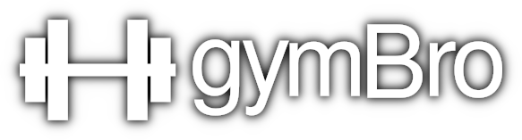

A simple fitness tracker app built with Laravel and Filament.

- 🏋🏻 track your sets, reps, and weight for each exercise
- 💪 view your progress over time with charts and graphs
- 📐 save body measurements and track your weight

## 🚀 Features

- [x] PWA
- [x] full dark mode support
- [ ] multilingual (English, Hungarian)
- [ ] imperial / metric support

## 🖥️ Installation

### Native

Installation for php-fpm + web server:

1. Clone the repository
2. Run `composer install`
3. Copy `.env.example` to `.env`
4. Run `php artisan key:generate`
5. Run `php artisan migrate --seed`
6. Profit!

## Docker Compose

TBD.
